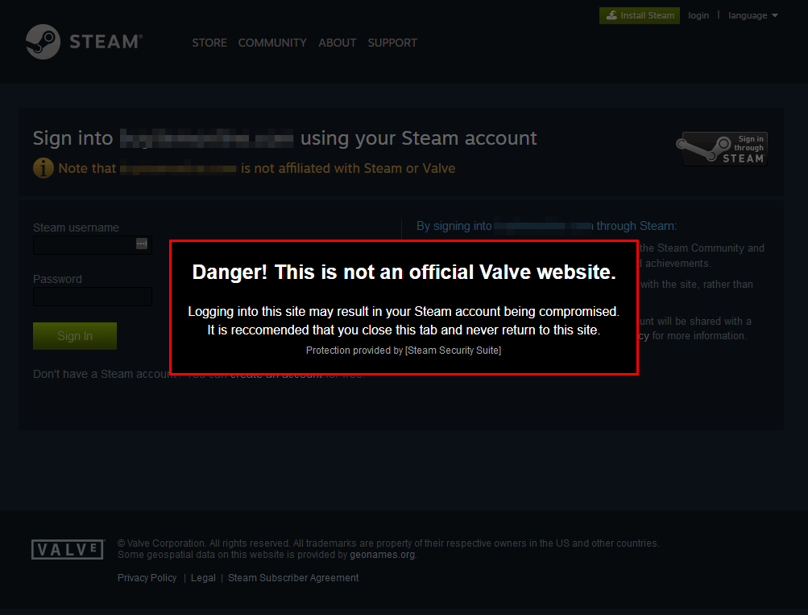

# [Steam Security Suite]
Steam Security Suite checks every page you visit to see if it's impersonating Steam, and will alert you if one is found.

[Install on Chrome](https://chrome.google.com/webstore/detail/steam-community-suite/gicnbiillhmpffbemfhmhnelldbnjblb) or [Install on Firefox](https://addons.mozilla.org/en-US/firefox/addon/steam-security-suite/)

